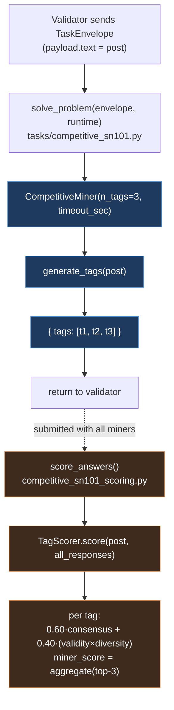
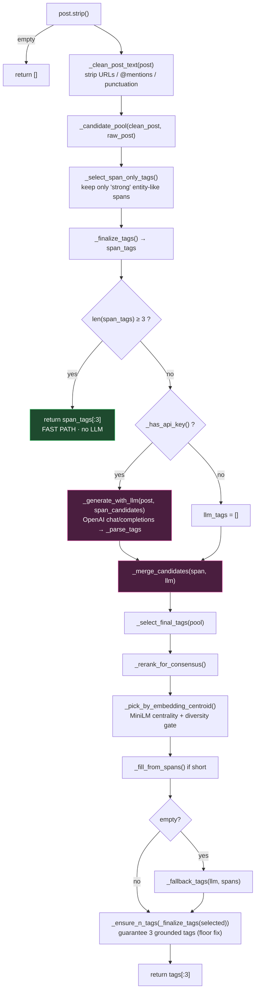
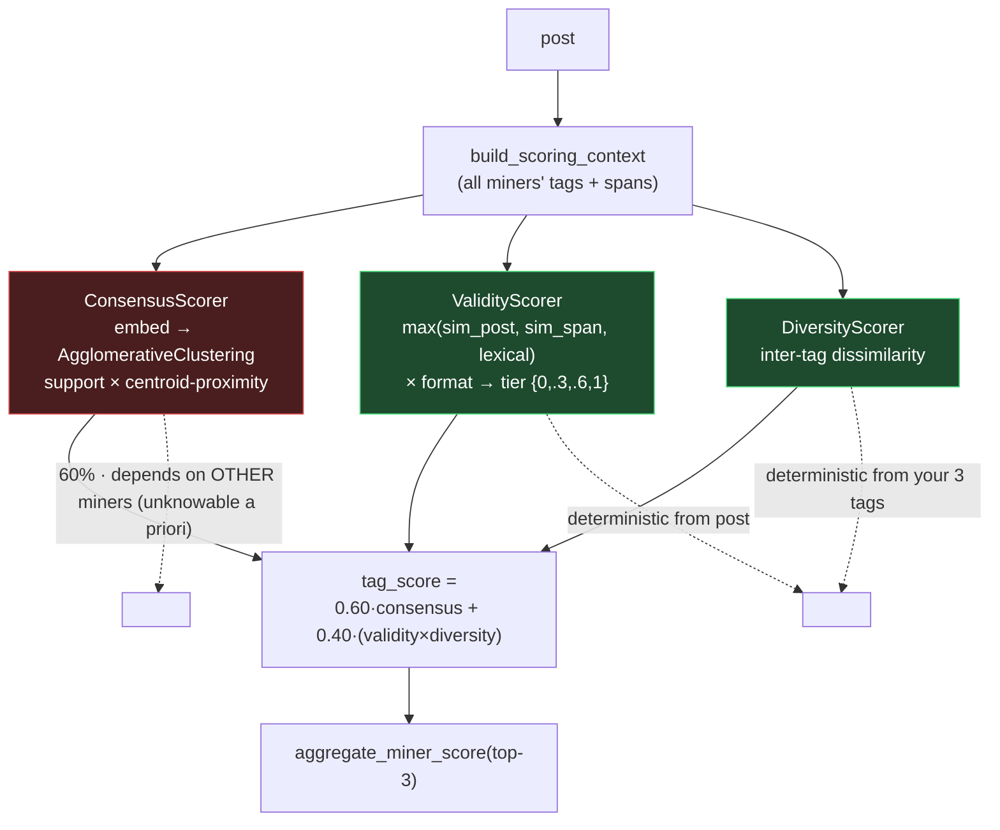

# SN101 Competitive Miner — Code Architecture

This document maps the current miner (`master` / `b0-floor` baseline) from the
validator request down to the scoring model it optimizes against.

Entry chain: `tasks/competitive_sn101.py:solve_problem` →
`CompetitiveMiner(...)` → `generate_tags(post)` →
`tasks/sn101_reference/core/competitive_miner.py`.

The `b1`–`b6` experiment branches only swap the **selection logic** in
diagram 2 (the middle block). Diagrams 1, 3, and 4 are identical across all
branches.

---

## 1. End-to-end flow: validator → miner → score

---

## 2. Inside `generate_tags` (baseline pipeline)

---

## 3. `_candidate_pool` internals (candidate generation + filtering)

```mermaid
flowchart LR
    subgraph SRC["sources (clean_post + raw_post)"]
        S1["build_spans()<br/>noun-ish spans"]
        S2["_expand_span_chunks()<br/>prefix/tail chunks"]
        S3["Capitalized words<br/>[A-Z][...]"]
        S4["#hashtags"]
        S5["@mentions"]
        S6["_token_ngram_candidates()<br/>1–2 grams (fallback)"]
    end

    SRC --> ADD["add(raw)"]
    ADD --> NORM["smart_tag() → normalize<br/>tag_wordmap brand map"]
    NORM --> TRIM["_trim_tag_edges()<br/>strip edge stop-words"]
    TRIM --> F1["_is_valid_format()"]
    F1 --> F2["_is_coherent_tag()<br/>reject fragments / contractions / dupes"]
    F2 --> F3["_is_junk_tag()<br/>reject slugs (o98n0hfax8), consonant runs"]
    F3 --> F4["_is_low_value_tag()<br/>reject generic / fluff"]
    F4 --> POOL["_sort_candidate_tags()<br/>prefer ~2-word tags"]

    classDef filt fill:#3a2e1e,stroke:#d9b84a,color:#fff
    class F1,F2,F3,F4 filt
```

---

## 4. The scoring model the miner optimizes against

---

## Strategy branches (selection-logic variants of diagram 2)

| Branch | Strategy | LLM | Embeddings | Core idea |
|--------|----------|-----|------------|-----------|
| `b0-floor` | Baseline balanced | gated | yes | span fast-path → LLM gate → centroid select |
| `b1` | Simplest extractive | no | no | first-mentioned post spans |
| `b2` | Extractive centroid | no | yes | tags nearest embedding centroid of candidates |
| `b3` | LLM abstractive | always | no | trust model's human-like tags, span backfill |
| `b4` | Topic salience | no | no | rank by position + entity signal + repetition |
| `b5` | Validity-max | no | yes | rank by validator grounding `max(sim_post, sim_span, lexical)` |
| `b6` | Ensemble (complex) | always | yes | Borda blend of validity + consensus + salience + LLM |

All variants share the same `_candidate_pool` (diagram 3), the same
`_ensure_n_tags` floor, and are scored by the same model (diagram 4).
